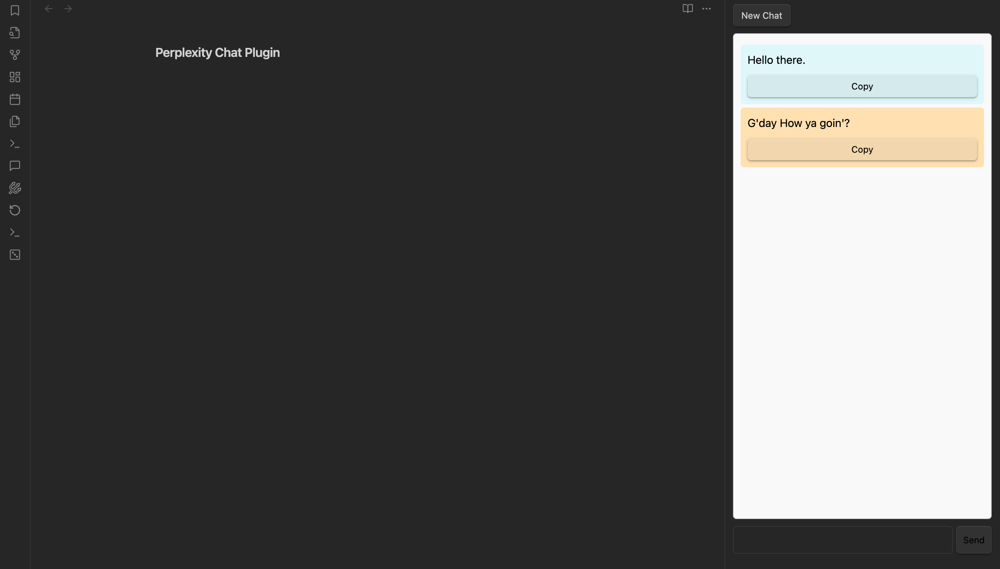

# Perplexity Chat Obsidian Plugin

A powerful plugin for Obsidian that integrates with the Perplexity API, enabling users to generate and interact with AI-driven responses directly from their notes. Enhance your note-taking experience with conversational AI capabilities seamlessly integrated into your workflow.

## Features

- **Chat Interface**: Engage in a chat-like interface to interact with the AI.
- **Dynamic Settings**: Customize your AI interaction with adjustable settings, including:
  - **API Key**: Securely store your API key for the Perplexity API.
  - **Model Selection**: Choose from various AI models to suit your needs.
  - **Temperature**: Adjust response randomness for more creative or deterministic outputs.
  - **Presence Penalty**: Control how much new content is favored in responses.
  - **Max Tokens**: Set the maximum number of tokens in the AI's responses.
  - **Custom System Prompt**: Define the initial input for the system to tailor its behavior.

## Installation

1. In Obsidian, open the **Settings**.
2. Navigate to the **Community plugins** section 
3. Click on **Install plugin** and select the downloaded file or paste the plugin's GitHub URL to install.
4. Enable the plugin after installation.

## Usage

1. **Open the Plugin**: Use the ribbon icon or the command palette (Ctrl/Cmd + P) to activate the Perplexity Chat.
2. **Configure Settings**: Go to the settings tab to enter your API key and customize model and interaction parameters.
3. **Start a Conversation**: Type your message in the chat input area and hit enter or click send. You can engage with the bot and receive AI-generated responses directly.
4. **Copy Messages**: Easily copy messages from the chat to share or store in your notes.

## Customizations

- You can adjust model parameters in the settings to influence the style and length of the responses.
- The custom system prompt allows you to set distinctive guidelines for the AI's behavior to match specific needs.

## Troubleshooting

If you run into issues:

- Ensure your API key is valid and has permissions to access the Perplexity API.
- Check the network connection to ensure the plugin can reach the API endpoint.
- Review the console for errors if the plugin does not behave as expected (use `F12` to open developer tools).

## Contributing

Contributions to enhance the plugin are welcome! If you have suggestions, bug reports, or would like to contribute code, please open an issue or submit a pull request on the GitHub repository.

## License

This plugin is licensed under the [MIT License]

## Contact

For questions, suggestions, or support, please reach out via [GitHub Issues]

---

This README was generated to assist users in understanding how to effectively use the Perplexity Chat plugin for Obsidian. Enjoy leveraging the power of AI in your note-taking!